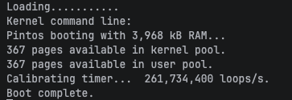
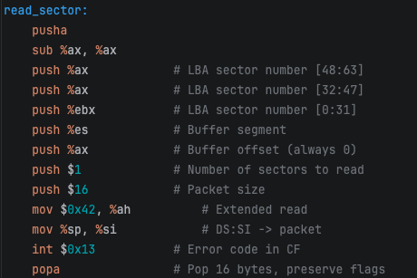
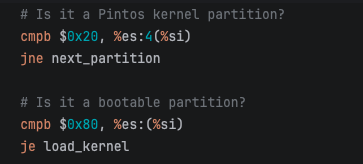
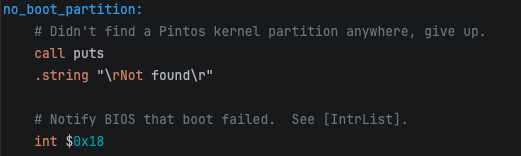
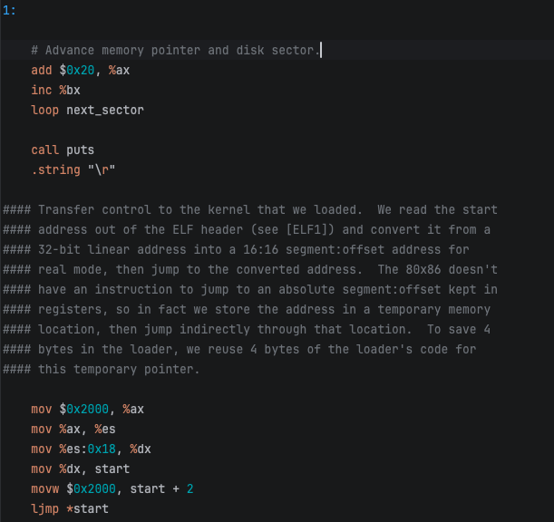

# Project 0: Getting Real

## Preliminaries

>Fill in your name and email address.

Jeremy Tan jeremytanjanzhe@gmail.com

>If you have any preliminary comments on your submission, notes for the TAs, please give them here.

>Please cite any offline or online sources you consulted while preparing your submission, other than the Pintos documentation, course text, lecture notes, and course staff.

## Booting Pintos

>A1: Put the screenshot of Pintos running example here.

## Debugging

#### QUESTIONS: BIOS 

>B1: What is the first instruction that gets executed?  
ljmp   $0x3630,$0xf000e05b

>B2: At which physical address is this instruction located?  
0xffff0

#### QUESTIONS: BOOTLOADER

>B3: How does the bootloader read disk sectors? In particular, what BIOS interrupt is used?  

The bootloader reads disk sectors using INT 0x13, function 0x42 (Extended Read Sectors). 
For each sector, the read_sector subroutine builds a 16-byte Disk Address Packet (DAP) on the stack, 
specifying the target LBA sector number (passed in EBX) and the destination buffer address (ES:0000). 
It then sets AH = 0x42, points DS:SI at the DAP, and issues int $0x13. 
On return, the carry flag indicates success (CF=0) or failure (CF=1).

>B4: How does the bootloader decide whether it successfully finds the Pintos kernel?
  
The bootloader scans the partition table of each hard disk, 
checking each of the up to 4 partition entries against two conditions:  
1.Partition type == `0x20`** (`cmpb $0x20, %es:4(%si)`) — identifies the partition as containing a Pintos kernel  
2.Bootable flag == `0x80`** (`cmpb $0x80, %es:(%si)`) — marks the partition as the active boot target

>B5: What happens when the bootloader could not find the Pintos kernel?

If no bootable Pintos partition (type `0x20`, status `0x80`) is found on any drive, 
the bootloader calls `puts` to print an error message and then executes `hlt`, halting the CPU indefinitely. 
The machine must be manually reset or powered off.

>B6: At what point and how exactly does the bootloader transfer control to the Pintos kernel?

After all kernel sectors have been loaded into memory at `0x20000`, the bootloader transfers control as follows:
1.Reads the ELF entry point** — loads the kernel's start address from offset `0x18` of the ELF header (`mov %es:0x18, %dx`), which is at `0x20000 + 0x18`  
2.Constructs a far pointer** — stores the entry point offset in `start` and the segment `0x2000` in `start + 2`, forming a 16:16 segment:offset address (`0x2000:entry_offset` = physical address `0x20000 + entry_offset`)  
3.Jumps indirectly** — executes `ljmp *start`, a far jump through the temporary pointer stored in memory, since x86 has no instruction to far-jump to an address held directly in registers  
At this point the bootloader's job is complete and the Pintos kernel takes over execution.

#### QUESTIONS: KERNEL

>B7: At the entry of pintos_init(), what is the value of expression `init_page_dir[pd_no(ptov(0))]` in hexadecimal format?

>B8: When `palloc_get_page()` is called for the first time,

>> B8.1 what does the call stack look like?
>>
>> 

>> B8.2 what is the return value in hexadecimal format?
>>
>> 

>> B8.3 what is the value of expression `init_page_dir[pd_no(ptov(0))]` in hexadecimal format?
>>
>> 

>B9: When palloc_get_page() is called for the third time,

>> B9.1 what does the call stack look like?
>>
>> 

>> B9.2 what is the return value in hexadecimal format?
>>
>> 

>> B9.3 what is the value of expression `init_page_dir[pd_no(ptov(0))]` in hexadecimal format?
>>
>> 

## Kernel Monitor

>C1: Put the screenshot of your kernel monitor running example here. (It should show how your kernel shell respond to `whoami`, `exit`, and `other input`.)

#### 

>C2: Explain how you read and write to the console for the kernel monitor.
